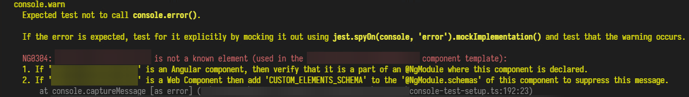
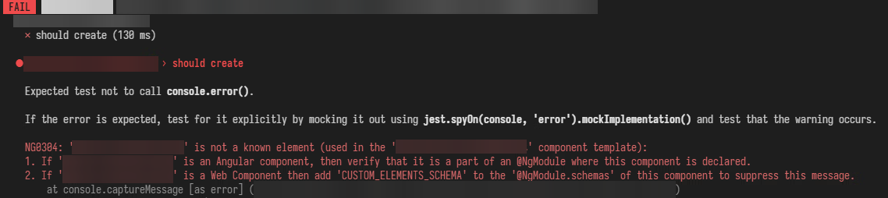

# Jest Capture Console

A Jest setup inspired on [jest-fail-on-console](https://github.com/ValentinH/jest-fail-on-console). This setup can display warnings or fail tests if a console method was run during a test.

## Reasoning behind it

While `jest-fail-on-console` is ideal to identify and stop console methods to make test fails (makes our CI's clean and healthier), it was noted that it is GOOD when you start a fresh new project.

However, on large projects where migrations are needed, it would immediately enter in panic mode specially if we have hundreds of tests to examine and determine what caused certain consoles to throw errors.

Here is where `@erickrodrcodes/jest-capture-console` enters. It can allow warnings of console methods being called on test, so your dev team can mitigate the problem, and once your team solves everything, you can switch the flag to make sure tests fails if a console method was called.

if you set the flag for your test to warn you about console implementations, you will see this:

|                                    |
| :-----------------------------------------------------------------------: |
| _Your team will be warned of unexpected console calls when running tests_ |

When you have controlled all the issues, turn on the flag to fail tests:

|                                                     |
| :-------------------------------------------------------------------------------------: |
| _When the flag is turned to fail when finding console implementations, tests will fail_ |

## Install

```shell
yarn add -D @erickrodrcodes/jest-capture-console
```

or

```shell
npm install -D @erickrodrcodes/jest-capture-console
```

## Usage

Identify your `jest.config.[js|ts]` file and look for your `setupFilesAfterEnv` option. If you do not have one, add it to your export configuration:

```js
export default {
  setupFilesAfterEnv: ['./jest.setup.ts'],
};
```

Usually, if you don't have a setup file for test, you will need to create a `jest.setup.[js|ts]` file. On it we will setup your test to capture console methods:

```ts
import { captureConsoleInTest } from '@erickrodrcodes/jest-capture-console';

// by default it will capture and warn console.error, console.log and console.warn
// test won't fail, but you will be warned on how to solve it.
captureConsoleInTest();
```

### Options

The setup accepts an object with multiple parameters for you to use.

```ts
captureConsoleInTest({
  ... // options described below will come here
})
```

#### `errorMessage`

Use this if you want to override the default error message of this library with a custom function.

**Signature**

```ts
type errorMessage = (methodName: 'assert' | 'debug' | 'error' | 'info' | 'log' | 'warn', bold: (string: string) => string) => string;
```

#### `itShould`

This will indicate to `captureConsoleInTest` how it will treat captured consoles. Use `error` to make a Test fail if a console method was used. use `warn` if you only want to warn in the terminal if a console was used.

| Type     | Values               | Default Value |
| -------- | -------------------- | ------------- |
| `string` | `'warn'` - `'error'` | `'warn'`      |

**Signature**

```js
itShould: 'warn' | 'error';
```

#### `onAssert`

Use this option to warn or make a test fail if `console.assert()` was captured on the test.

| Type      | Default Value |
| --------- | ------------- |
| `boolean` | `false`       |

#### `onDebug`

Use this option to warn or make a test fail if `console.debug()` was captured on the test.

| Type      | Default Value |
| --------- | ------------- |
| `boolean` | `false`       |

#### `onError`

Use this option to warn or make a test fail if `console.error()` was captured on the test.

| Type      | Default Value |
| --------- | ------------- |
| `boolean` | `true`        |

#### `onInfo`

Use this option to warn or make a test fail if `console.info()` was captured on the test.

| Type      | Default Value |
| --------- | ------------- |
| `boolean` | `false`       |

#### `onTrace`

Use this option to warn or make a test fail if `console.trace()` was captured on the test.

| Type      | Default Value |
| --------- | ------------- |
| `boolean` | `false`       |

#### `onWarn`

Use this option to warn or make a test fail if `console.warn()` was captured on the test.

| Type      | Default Value |
| --------- | ------------- |
| `boolean` | `true`        |

#### `allowMessage`

This function is called for every console method supported by this utility.
If `true` is returned, the message will show in the console and the test won't fail, even if `itShould` is `'error'`

```ts
// signature
type allowMessage = (message: string, methodName: 'assert' | 'debug' | 'error' | 'info' | 'log' | 'warn' | 'trace', context: { group: string; groups: string[] }) => boolean;
```

#### `silenceMessage`

This function is called for every console method supported by this utility.
If `true` is returned, the message will not show in the console and the test won't fail, even if `itShould` is `'error'`

```ts
// signature
type silenceMessage = (message: string, methodName: 'assert' | 'debug' | 'error' | 'info' | 'log' | 'warn', context: { group: string; groups: string[] }) => boolean;
```

#### skipTest

Use this if you want to ignore checks introduced by this library for specific tests determined by
the return of the callback function. Return `false` if you do not want to skip console checks for
the specific test and return `true` if you would like to skip it.

```ts
const ignoreList = [/.*components\/SomeComponent.test.tsx/];
const ignoreNameList = ['some component some test name'];

captureConsoleInTest({
  skipTest: ({ testPath, testName }) => {
    for (const pathExp of ignoreList) {
      const result = pathExp.test(testPath);
      if (result) return true;
    }

    if (ignoreNameList.includes(testName)) {
      return true;
    }

    return false;
  },
});
```

#### `shouldPrintMessage`

Use this to print the message immediately when called not awaiting the test to finish. This is useful to show the message if there are
other or earlier test failures which will result in the fail on console error to be hidden by jest.

| Type      | Default Value |
| --------- | ------------- |
| `boolean` | `false`       |

## License

[MIT](./LICENSE)

## Credits

This project is based on the work of [Valentin Herview](https://github.com/ValentinH) library `jest-fail-on-console`.

---

Built with love with <a alt="Nx logo" href="https://nx.dev" target="_blank" rel="noreferrer"></a>
